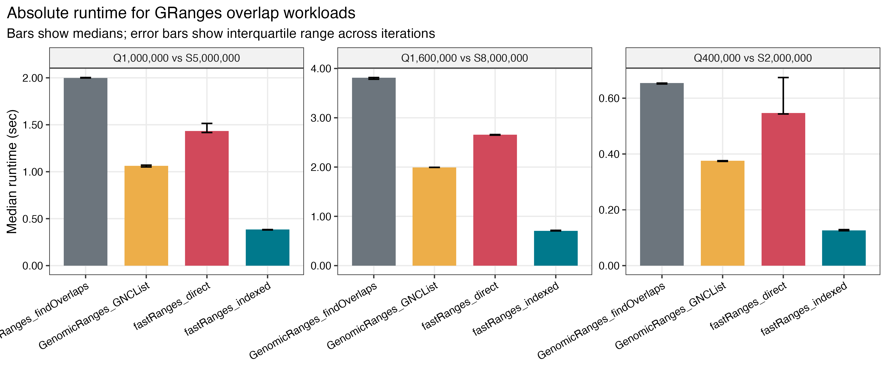
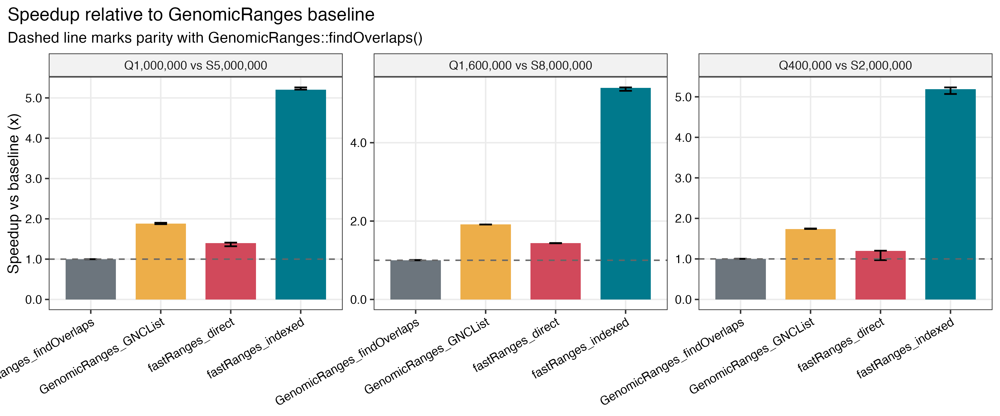
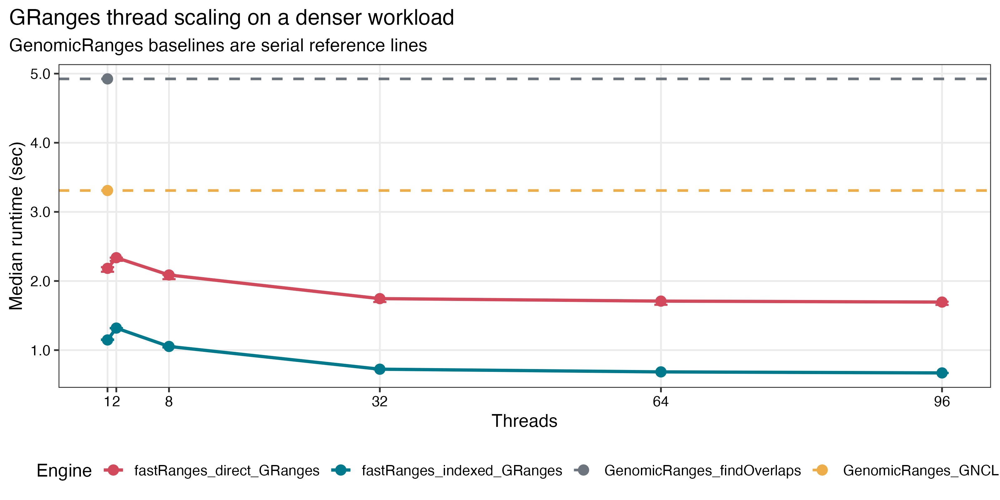
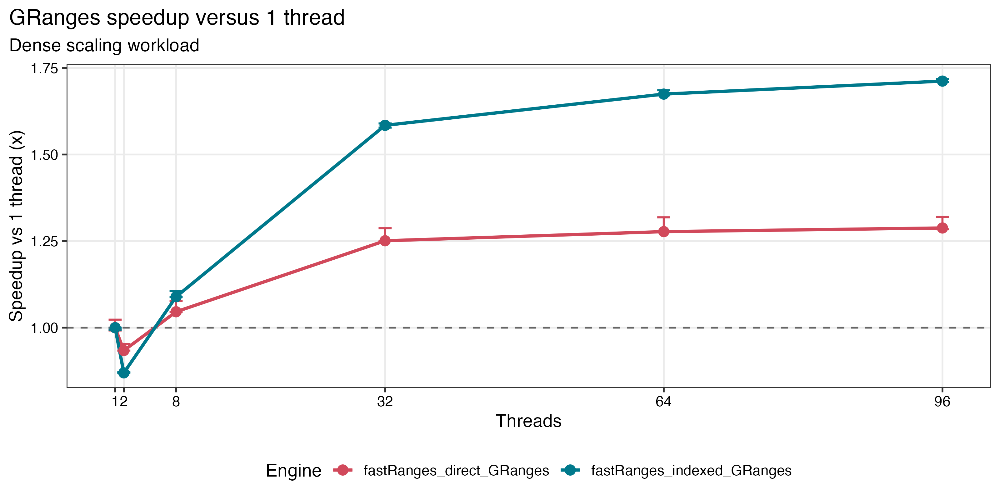
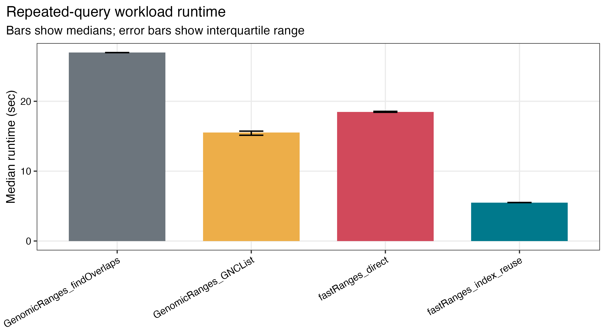
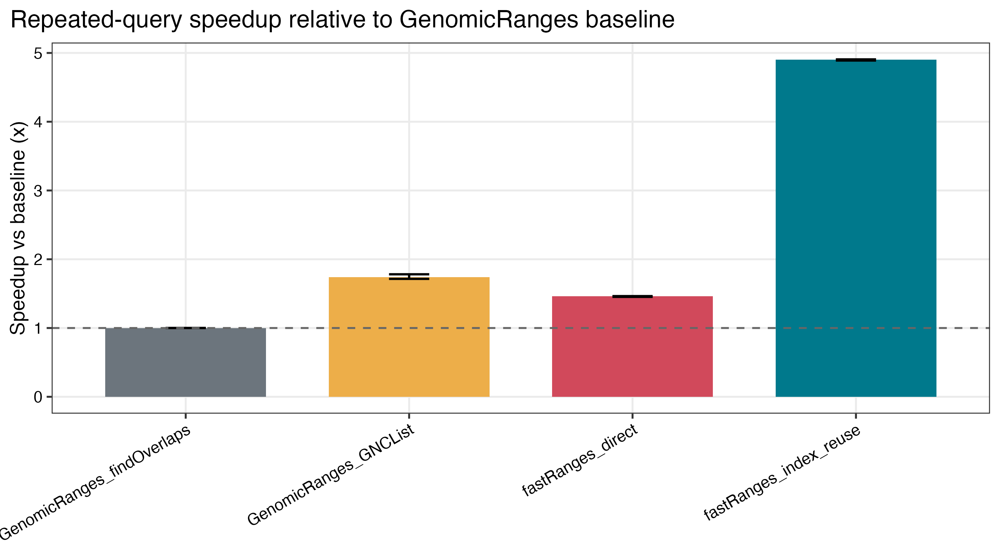
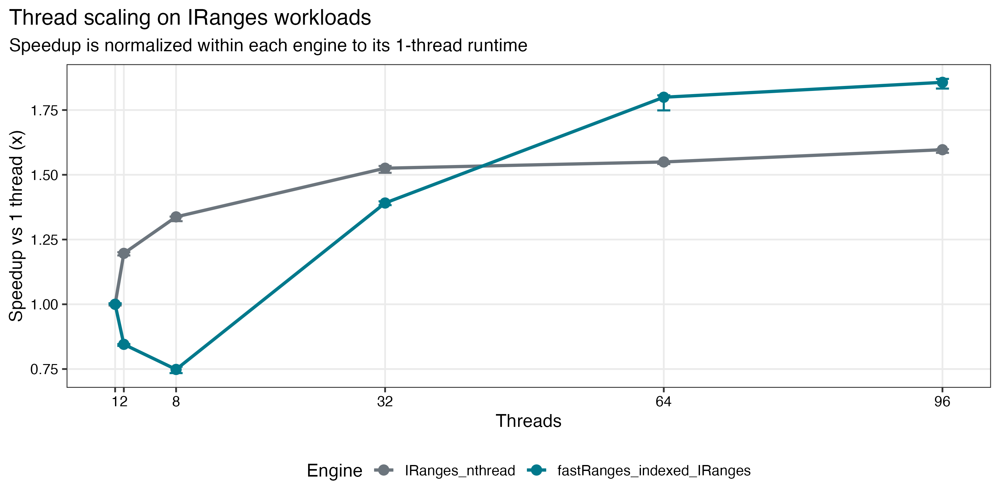
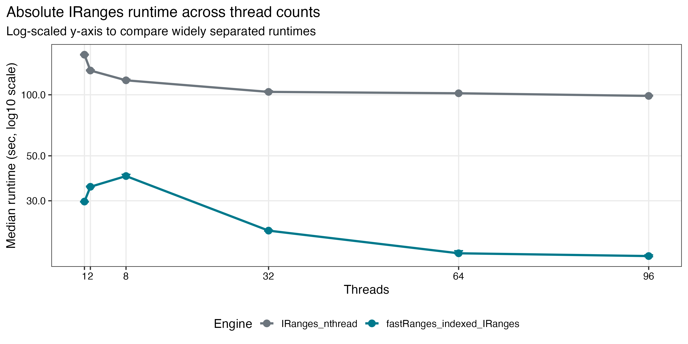
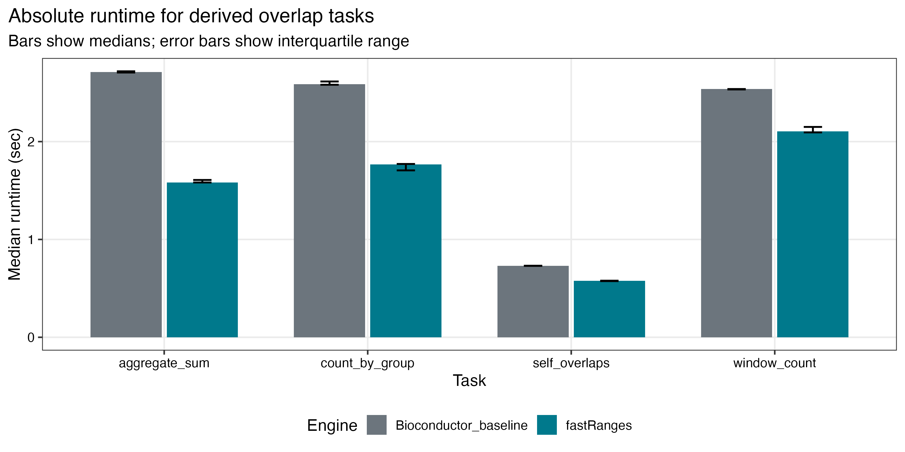
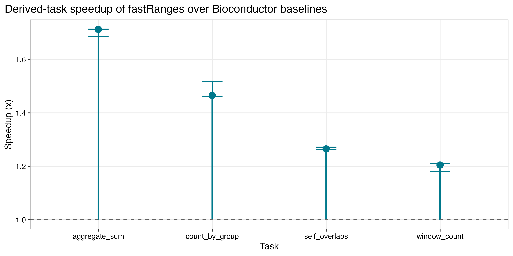

# fastRanges Benchmark Highlights

This document is a compact, GitHub-friendly summary of the saved benchmark
results for `fastRanges`. It is intended for quick reading. The full narrative
report with additional plots and code is available in:

- `inst/benchmarks/benchmark_result_interpretation.qmd`
- `inst/benchmarks/benchmark_result_interpretation.html`

The figures below were generated from the saved tables in
`inst/benchmarks/benchmark_result/results`.

## Benchmark Context

- Run timestamp: `2026-03-13 00:15:29`
- Iterations per benchmark point: `3`
- Maximum threads used: `96`
- Thread grid: `1, 2, 8, 32, 64, 96`
- Available physical cores: `96`
- R version: `4.5.2`
- fastRanges version: `0.99.0`
- GenomicRanges version: `1.60.0`
- IRanges version: `2.44.0`

These benchmarks were designed to answer four practical questions:

1. Is `fastRanges` faster than standard Bioconductor overlap workflows?
2. How much does explicit subject indexing help?
3. Does performance scale on a high-core server?
4. Do gains persist for downstream summary APIs, not just raw overlap search?

## Main Results

1. `fastRanges_indexed` was the fastest engine in every saved `GRanges`
   scenario.
2. Across the saved `GRanges` workloads, indexed `fastRanges` delivered about
   `5.19x` to `5.40x` speedup relative to plain
   `GenomicRanges::findOverlaps()`.
3. `fastRanges_direct` was also faster than the plain GenomicRanges baseline,
   but its gains were smaller, about `1.20x` to `1.44x`.
4. For repeated-query workloads, `fastRanges_index_reuse` achieved about
   `4.90x` speedup over `GenomicRanges::findOverlaps()`.
5. On the large `IRanges` workload, indexed `fastRanges` had the best absolute
   runtime at every tested thread count.
6. On the denser `GRanges` scaling workload, indexed `fastRanges` reached about
   `1.71x` speedup versus its own 1-thread baseline at `96` threads.
7. Derived APIs such as grouped counting and overlap aggregation also remained
   faster than Bioconductor baselines, with speedups up to about `1.71x`.

## GRanges End-to-End Runtime

This figure shows the absolute runtime for large `GRanges` overlap workloads.
The main message is simple: the indexed `fastRanges` path is the fastest in
every saved scenario, and the gap widens rather than disappears at larger input
sizes.



Interpretation:

- `fastRanges_indexed` is the absolute winner in all three saved scenarios.
- `fastRanges_direct` still improves on plain `GenomicRanges::findOverlaps()`,
  which means the core engine is competitive even without index reuse.
- `GenomicRanges_GNCList` is the strongest Bioconductor-native comparator, but
  it remains slower than indexed `fastRanges`.

## GRanges Relative Speedup

Absolute runtime is useful, but relative speedup makes the effect size easier
to communicate in a paper.



Interpretation:

- Indexed `fastRanges` consistently delivered roughly `5x` speedup over plain
  `GenomicRanges::findOverlaps()`.
- `GenomicRanges_GNCList` improved over plain `findOverlaps()`, confirming
  that subject preprocessing matters.
- The best overall result came from combining reuse-friendly indexing with the
  `fastRanges` engine.

## GRanges Thread Scaling on a Denser Workload

The updated benchmark now includes a denser `GRanges` scaling design. This is
important because the original end-to-end `GRanges` panel mainly answered
"which engine is fastest?" but did not isolate how much extra threading helps
once overlap density increases.





Interpretation:

- `fastRanges_direct_GRanges` shows the gain from the current overlap kernel
  without subject index reuse.
- `fastRanges_indexed_GRanges` shows the additional benefit of reusing the
  subject index.
- On this denser workload, indexed `fastRanges` reached about `1.71x` speedup
  versus its own 1-thread runtime at `96` threads.
- The serial `GenomicRanges` baselines remained above the indexed
  `fastRanges` trajectory throughout, so the faster absolute result is not
  limited to sparse workloads.

## Repeated-Query Workloads

This is one of the most important practical use cases in genomics: the same
subject annotation is queried repeatedly across many batches, samples, or
resamples.





Interpretation:

- `fastRanges_index_reuse` completed the repeated-query workload in about
  `5.50` seconds.
- Plain `GenomicRanges::findOverlaps()` required about `26.97` seconds.
- This corresponds to about `4.90x` speedup versus the plain baseline.
- The repeated-query benchmark is the clearest justification for using
  `fast_build_index(subject)` in production workflows.

## IRanges Scaling on a 96-Core Machine

The large `IRanges` benchmark isolates the interval engine more directly and
shows how performance changes with thread count.





Interpretation:

- `IRanges_nthread` scaled more smoothly at low thread counts.
- `fastRanges_indexed_IRanges` started from a much faster serial baseline and
  remained the absolute winner at every tested thread count.
- The best stored runtime was about `16.01` seconds for indexed `fastRanges`
  at `96` threads.
- The best stored `IRanges_nthread` runtime was about `98.71` seconds, also
  at `96` threads.
- That means the key practical result is not only scaling behavior, but the
  much lower absolute runtime of the indexed `fastRanges` path.

## Derived API Performance

One concern with fast overlap engines is that the gain may disappear in
downstream summaries. The saved results do not support that concern.





Interpretation:

- `fastRanges` remained faster than Bioconductor baselines for all stored
  derived tasks.
- Approximate speedups were:
  - `aggregate_sum`: `1.71x`
  - `count_by_group`: `1.47x`
  - `self_overlaps`: `1.27x`
  - `window_count`: `1.20x`
- This supports the claim that performance gains are retained in workflow-level
  summaries rather than appearing only in raw overlap search.

## Recommended Usage Based on These Results

- Use `fast_find_overlaps(query, subject, ...)` for one-off overlap calls.
- Use `idx <- fast_build_index(subject)` and then query `idx` when the same
  subject will be reused.
- Prefer the indexed path for repeated-query benchmarking, high-throughput
  pipelines, and server-scale execution.
- For large `IRanges` workloads, benchmark on your own hardware, but expect the
  indexed `fastRanges` path to be the most relevant performance mode.

## Bottom Line

The saved benchmark results support a consistent conclusion: `fastRanges`
improves overlap throughput over standard Bioconductor baselines, and the
largest gains occur when subject indexing is reused across many queries. Those
gains persist in derived overlap summaries, which makes the package useful as a
workflow engine rather than only as a faster replacement for one overlap call.

## Reproducibility

- Saved result tables: `inst/benchmarks/benchmark_result/results`
- Saved software versions: `inst/benchmarks/benchmark_result/results/package_versions.csv`
- Full interpretation report:
  `inst/benchmarks/benchmark_result_interpretation.qmd`
- Main benchmark runner:
  `inst/benchmarks/benchmark_bioc.qmd`

To rerender the interpretation report:

```bash
quarto render inst/benchmarks/benchmark_result_interpretation.qmd
```
